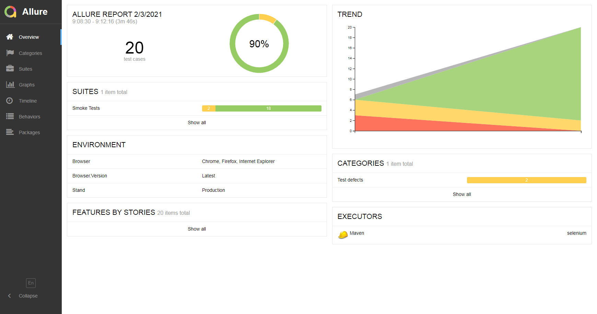
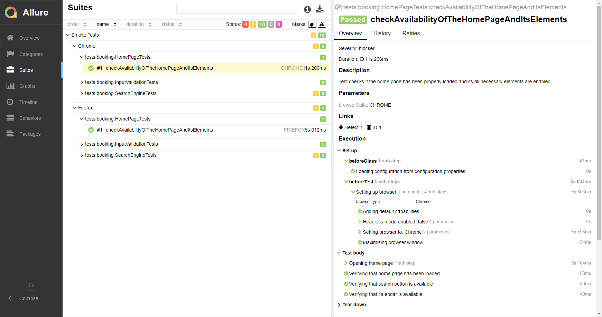
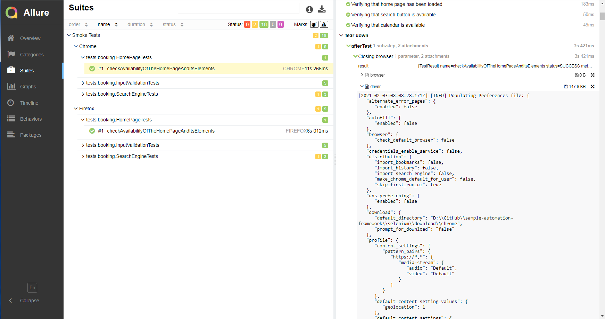
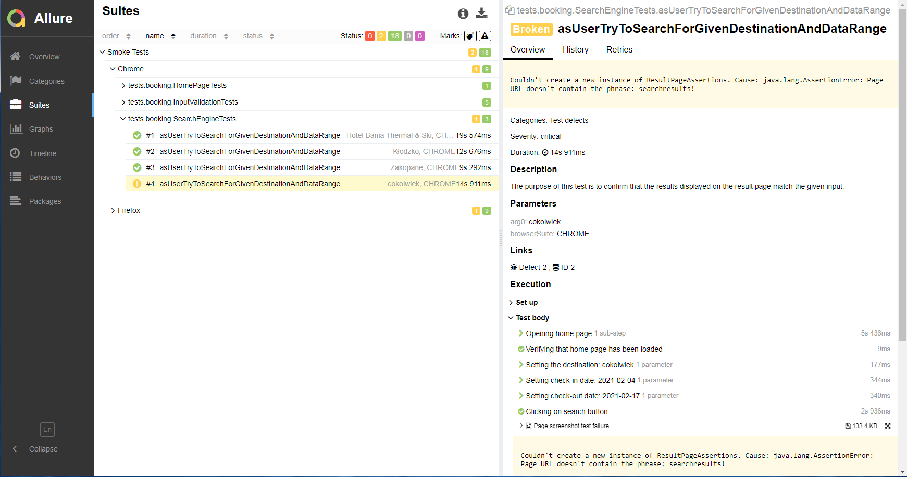
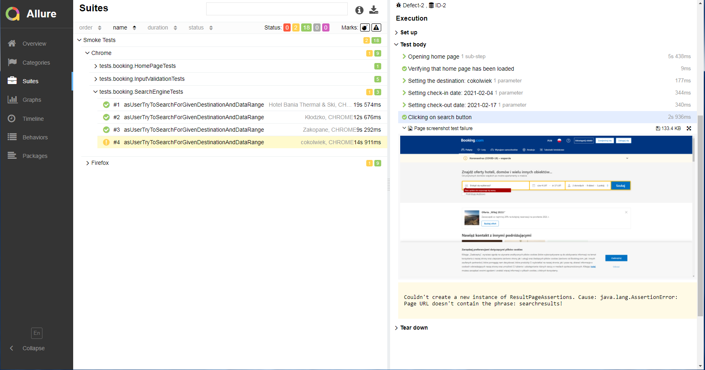

# sample-automation-framework
A sample framework for automation E2E and API tests.

## Introduction:
This is my demo project to show how to build a complete framework for testing websites using Selenium and Web Services via API testing.

It consists of two sub-modules:
- selenium
- rest-assured (pre-development phase)

## Prerequisites:
- JDK 11 (an installation package can be download from [here](https://www.oracle.com/pl/java/technologies/javase-jdk11-downloads.html) - remember to select the "Add to PATH" option during installation).
- Maven 3.6.x (instructions explaining how to install and configure Maven are [here](http://maven.apache.org/install.html)).
- JetBrains IntelliJ IDEA Community Edition 2020 (optional but strongly recommended - available [here](https://www.jetbrains.com/idea/download/#section=windows)).

## Installing:
Steps to install the project locally:

*Command line*:
1. *Download the project directly from the repository to your hard drive.*
2. *Open the command line in the project root folder.*
3. *Type `maven install -DskipTests` and press enter.* 

*IntelliJ*
- Import the project as a new Maven project from Version Control or from an external model - [more information](https://www.jetbrains.com/help/idea/import-project-or-module-wizard.html?keymap=primary_windows#import-project)

## CI/CD
Simple examples of configuration files:
- `Jenkinsfile`
- `Jenkinsfile-docker`
- `docker-compose.yml`

have been included in the repository to allow tests to be run remotely using Jenkins and/or Docker.

See:
 - https://www.jenkins.io/doc/book/pipeline/
 - https://github.com/SeleniumHQ/docker-selenium

## Quick start
I have prepared some tests to demonstrate how the framework works.

#### Selenium
My focus was not on them actually testing the application, but on showing how to write and structure the tests themselves.
I chose booking.com as a more 'real life' example, where even such simple tests sometimes require thoughtful solutions.

The easiest way to run tests and generate a report:
- open the command line in the project root folder and type: `mvn clean test allure:serve -pl selenium`
- alternatively, apply the same command using IntelliJ's built-in Maven plugin
- it will run the example test suite specified in pom.xml:

```
<suiteXmlFiles>
    <suiteXmlFile>${project.basedir}\src\test\resources\smoke-tests.xml</suiteXmlFile>
</suiteXmlFiles>
```


*Examples of generated test reports (Allure Framework):*

Overview:



Passed:




Failed/broken:




## To do list:
- [ ] rest-assured module
- [ ] improved CI/CD configuration

## Authors:
- Maciek Gawłowski [LinkedIn](https://www.linkedin.com/in/maciek-gaw%C5%82owski/)

## Licence:
This project is under the MIT License

## Acknowledgments:
This project would not have come about if I had not found inspiration and ideas from the sources listed below:

- [JavaStart courses](https://javastart.pl/)
- https://testng.org/doc/
- https://docs.qameta.io/allure/
- https://www.guru99.com/
- https://stackoverflow.com/
- others